Copyright(c) 2025 Nous Research. All rights reserved.

# nGPT
This is open-source reproduction of NVIDIA's [nGPT]([url](https://arxiv.org/abs/2410.01131)) (Normalized Transformer with Representation Learning on the Hypersphere) paper by Loshchilov et al., which claims to reduce "the number of training steps required to achieve the same accuracy by a factor of 4 to 20, depending on the sequence length," compared to a baseline transformer model.
## Project Overview
This repository provides modeling and training code for a modified GPT-2 and nGPT model as well as our results. Both models were pre-trained on [OpenWebText](https://huggingface.co/datasets/Skylion007/openwebtext). We attempt to adhere to the paper's specifications as closely as possible.

### Dependencies

 - **Hugging Face [transformers](https://github.com/huggingface/transformers) library**: `modeling_ngpt.py` and `modeling_gpt2.py` extend the `PreTrainedModel` class that Hugging Face provides.
 - **nanoGPT**: the training and data generation code build off this repository (`train_ngpt.py`, `train_gpt2.py` `data/openwebtext_llama/prepare.py`)
 - **EleutherAI/lm-evaluation-harness**: used for hellaswag, arc easy, winogrande, wsc273, and lambada-openai evals (`eval_gpt2.py`, `eval_ngpt.py`)

### Key Modifications
#### Tokenization

The LLaMA tokenizer (vocab size 32000) is used instead of the GPT tokenizer (vocab size 50257). See `data/openwebtext_llama/prepare.py`.
#### GPT-2

 - SwiGLU activation function
 - Rotary Position Embeddings (RoPE)
 - No weight tying between the input token embedding layer and the final output logits layer

#### nGPT
See paper for detailed explanations, particularly Section 2.6. Briefly, all hidden vectors and weight vectors that lie along the embedding dimension are normalized to have unit norm and lie on the same unit hypersphere.

### Training

0.5B models with 1024 and 4096 context length were trained on OpenWebText. We use the same parameters as specified in the nGPT paper as shown below. We use an initial learning rate of 15e-4 for 1024 context length and 30e-4 for 4096 context length.

 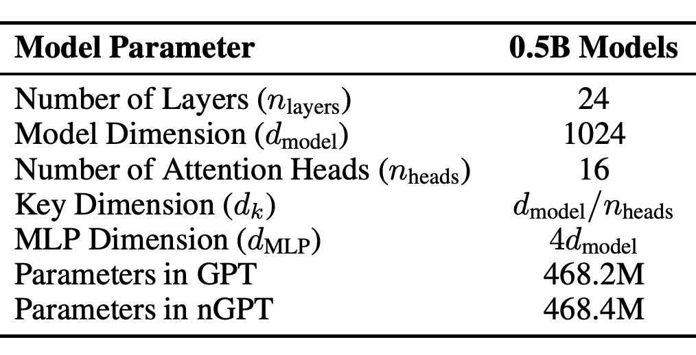
 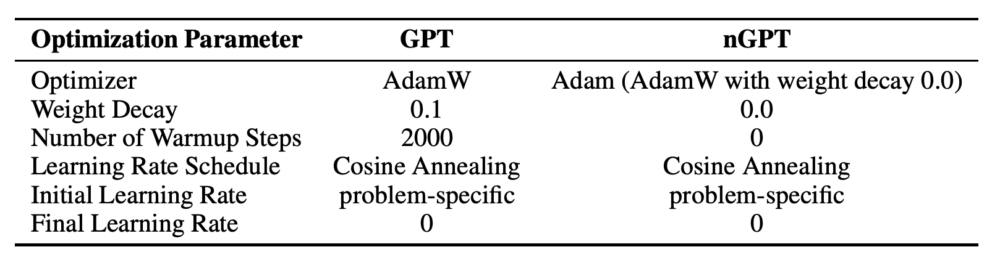

### Results

By visual inspection of the following graphs, we observe roughly 1.5-2x and 4x speedup at ~200 billion tokens for 1k and 4k context length, respectively. Note that every data point on the following graphs represent **separate** training runs that each ran to completion (i.e. different learning rate schedules).

#### Loss

 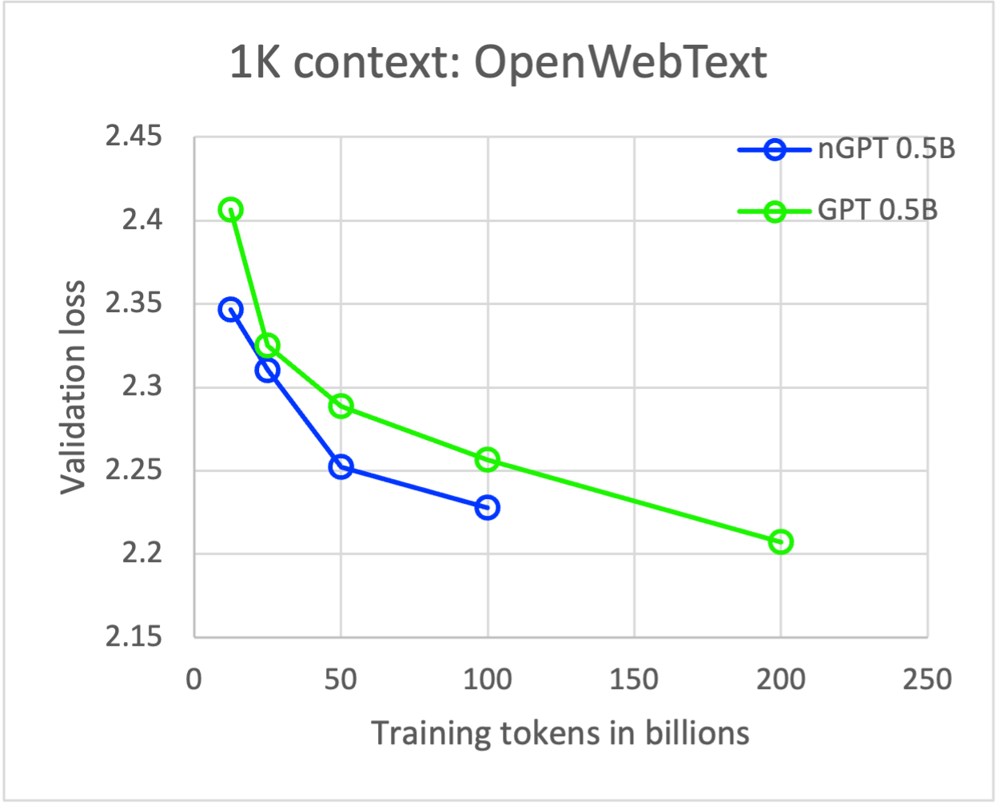
 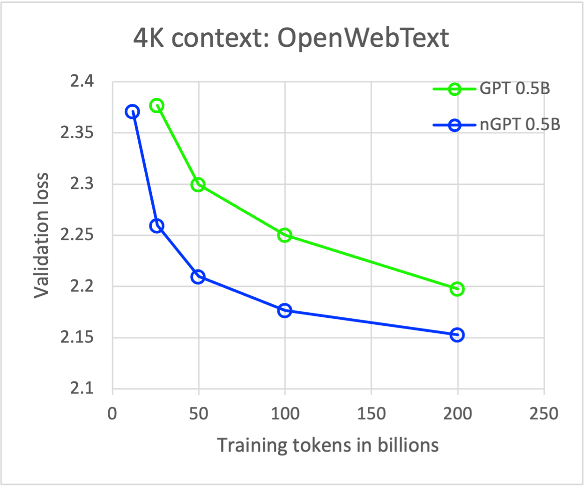

#### Performance on downstream tasks (1k context)

 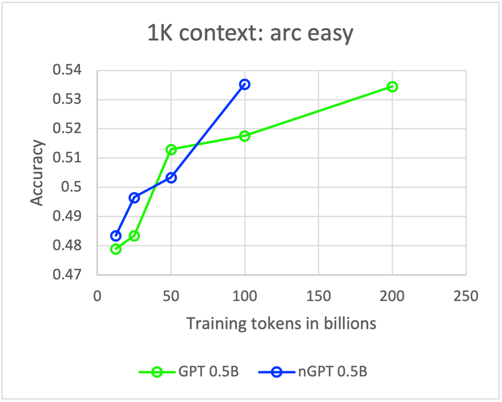
 
 

 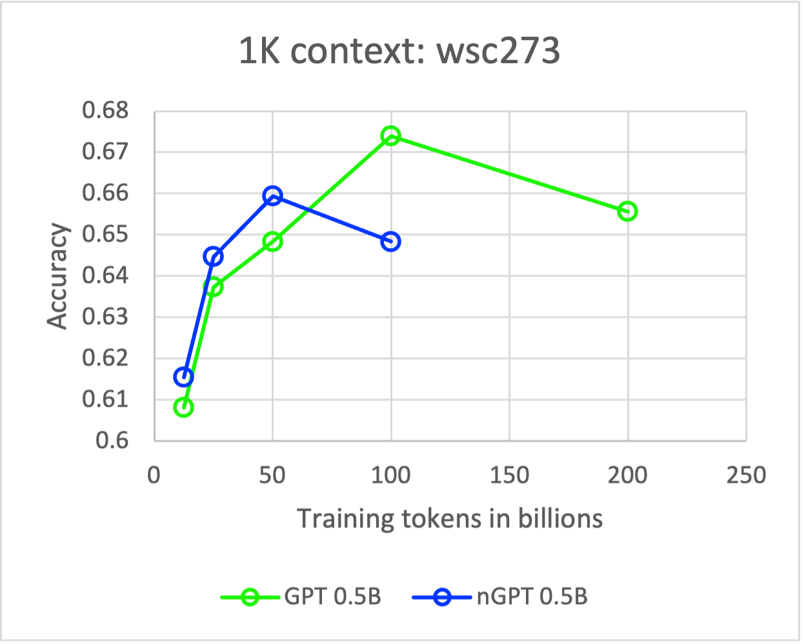
 
 

#### Performance on downstream tasks (4k context)

 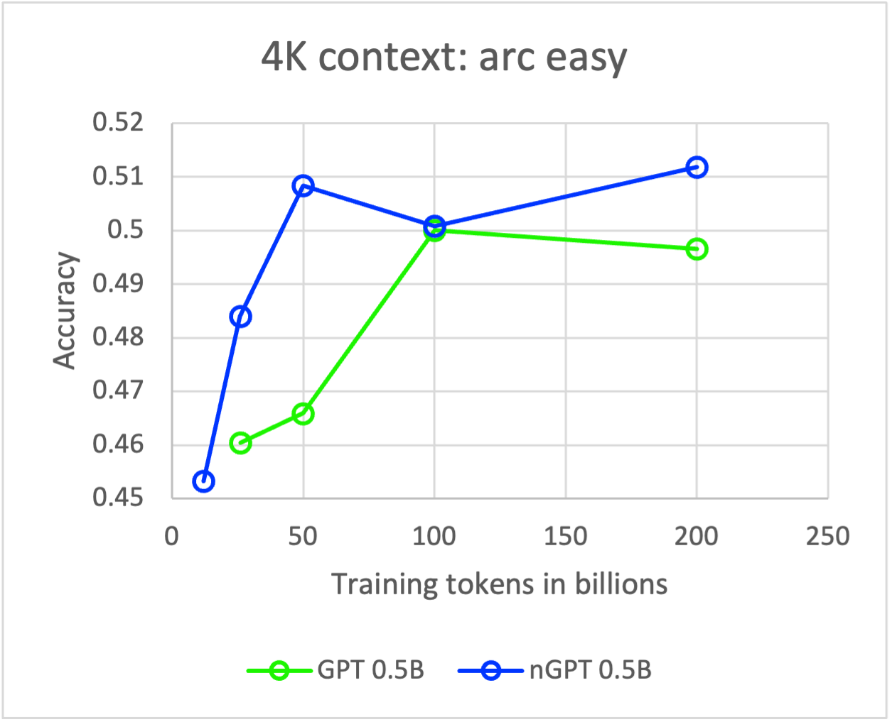
 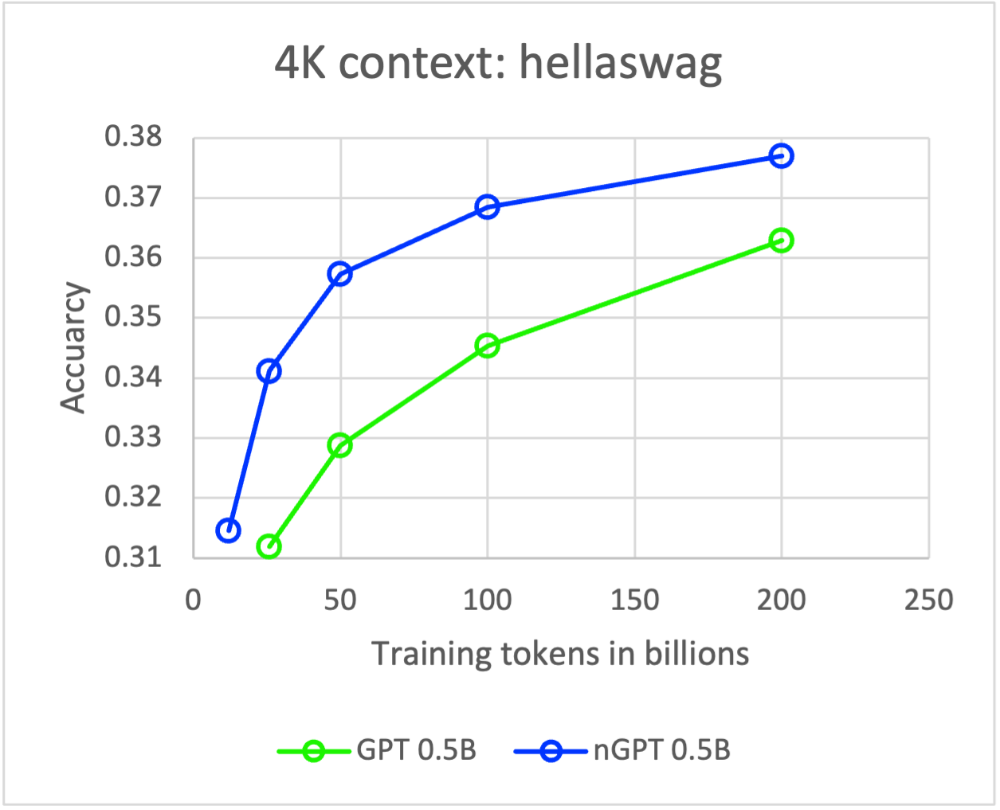
 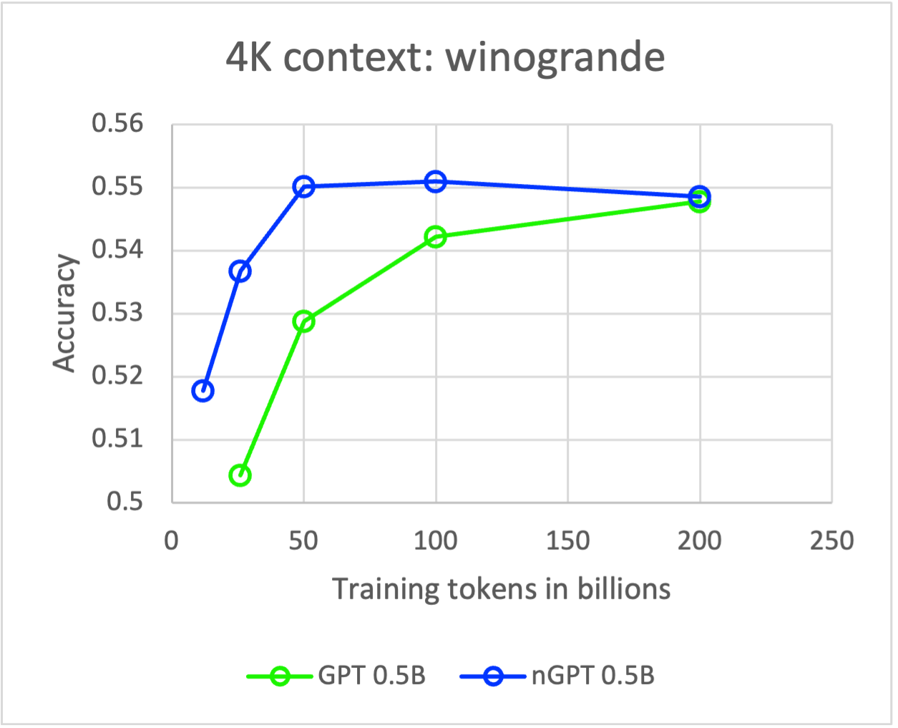

 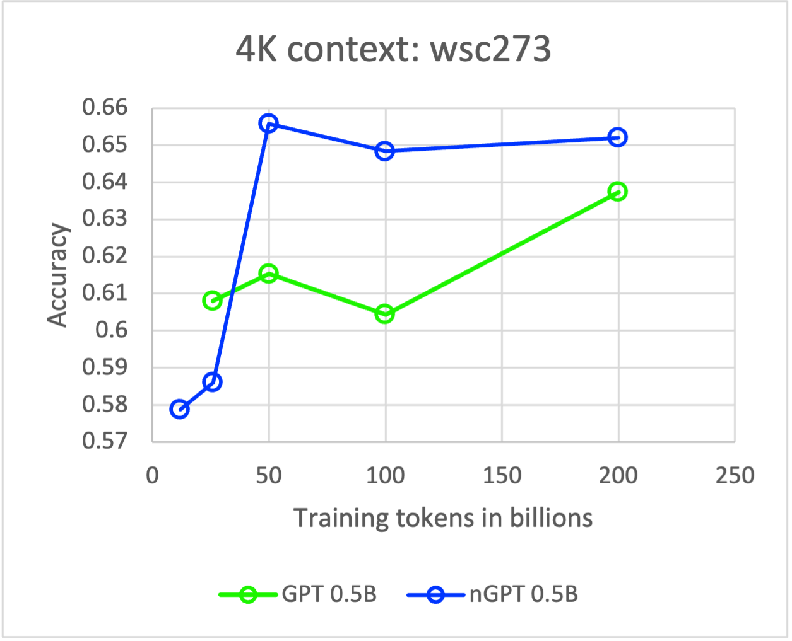
 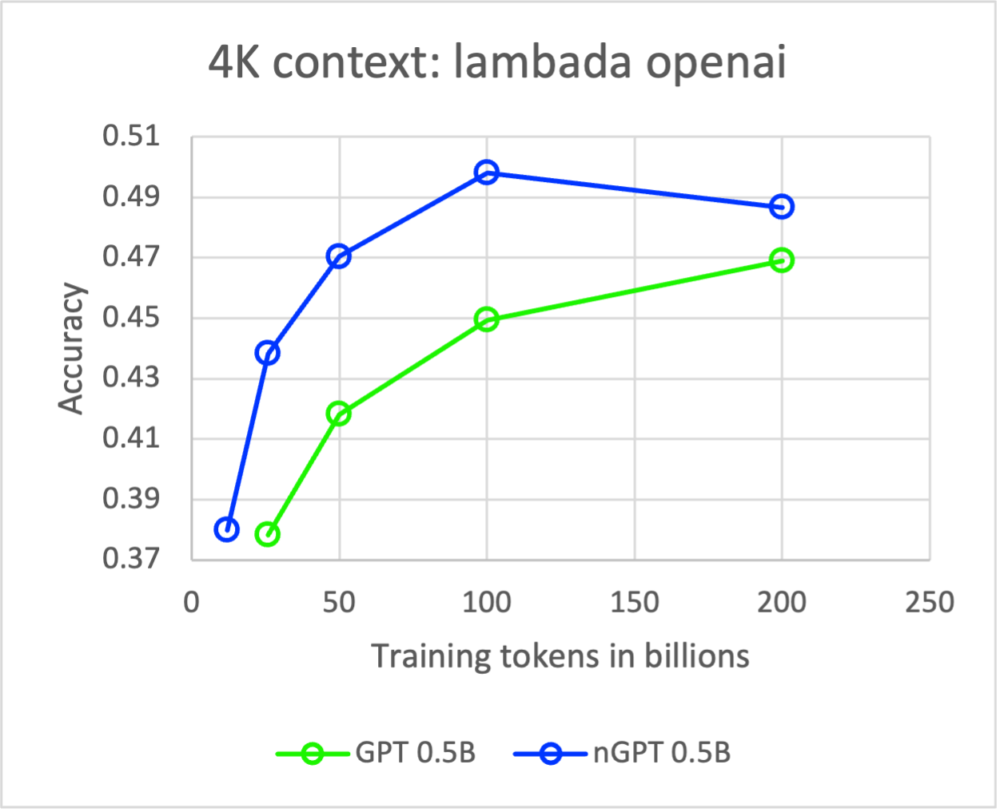
 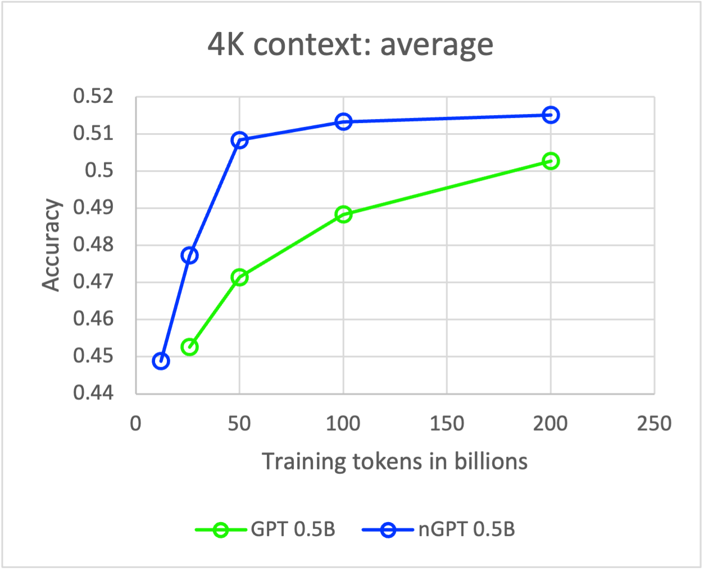

#### Wall-Clock Time for Training on 100B training tokens

### Analysis

We observe a smaller speedup than the nGPT paper claims. This is because the model parameters in this experimental reproduction are stored in float32 while the original paper stores them in bfloat16. NVIDIA's open source reproduction claims the following:

> In order to reflect our experimental setup of the paper where parameters of matrices are in bfloat16, we also set bfloat16 as the dtype of network parameters (all except embeddings). Apparently, the change from float32 to bfloat16 only moderately affects nGPT but greatly degrades performance of the baseline GPT.

We observe the above results in our reproduction as well — our nGPT model closely matches the experimental results, but our GPT-2 model performs better with float32 model parameters. For 0.5B models at 1k context length, while the paper claims 4x speedup with bfloat16 parameters at ~400 billion tokens, our nGPT reproduction achieves roughly 1.5-2x speedup with float32 parameters at ~200 billion tokens. For 0.5B models at 4k context length, while the paper claims 10x speedup with bfloat16 parameters at ~400 billion tokens, nGPT achieves roughly 4x speedup with float32 parameters at ~200 billion tokens. Moreover, we observe greater speedups for longer training runs.
